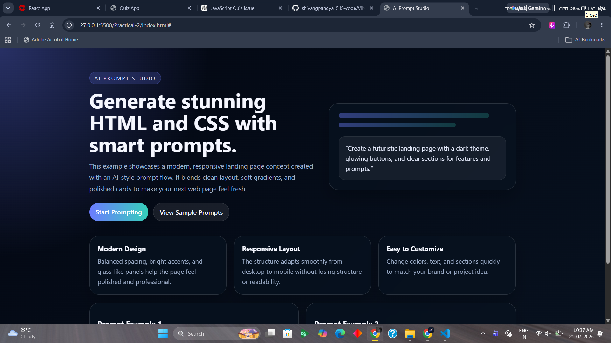

# Vibe Coding

This project contains a simple HTML/CSS landing page created as part of a practical assignment. The page demonstrates a modern, responsive design with a dark neon theme, polished cards, and clear call-to-action buttons.

## Project Structure

- Practical-1/ - Contains the first practical file.
- Practical-2/ - Contains the HTML page for the second practical.
  - Index.html - The main landing page.

## Features

- Responsive layout
- Modern hero section
- Styled buttons and feature cards
- Clean dark-themed UI
- Easy to customize with HTML and CSS

## How to View

1. Open the file [Practical-2/Index.html](Practical-2/Index.html) in your browser.
2. Alternatively, you can open the folder in a live preview editor such as VS Code Live Server.

## Technologies Used

- HTML5
- CSS3

## Purpose

This project is intended to showcase how AI-style prompts can be turned into a visually appealing webpage using basic HTML and CSS.

## Output

